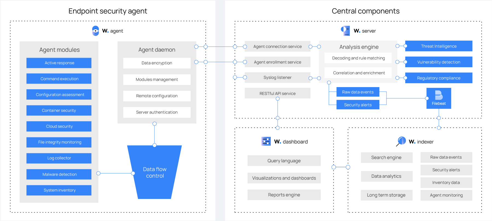
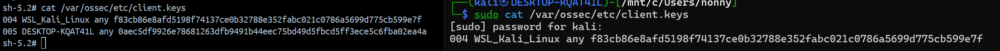
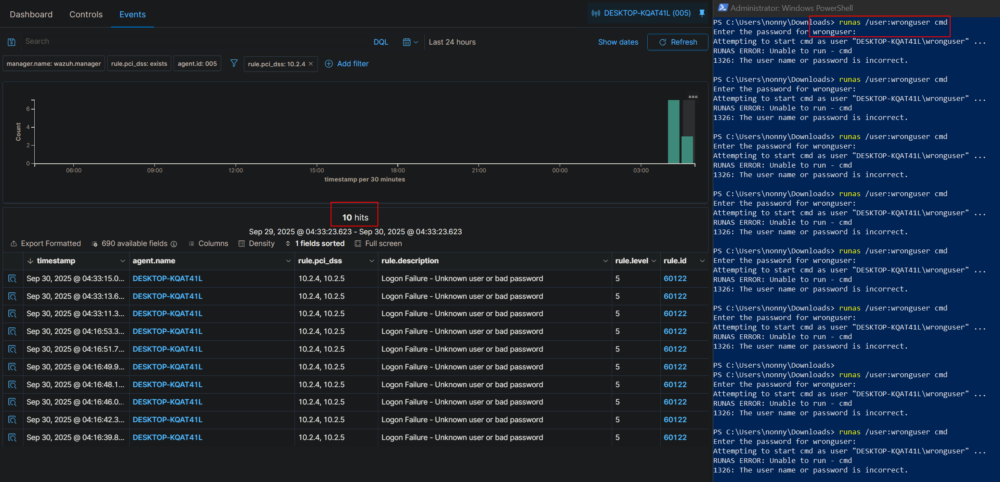
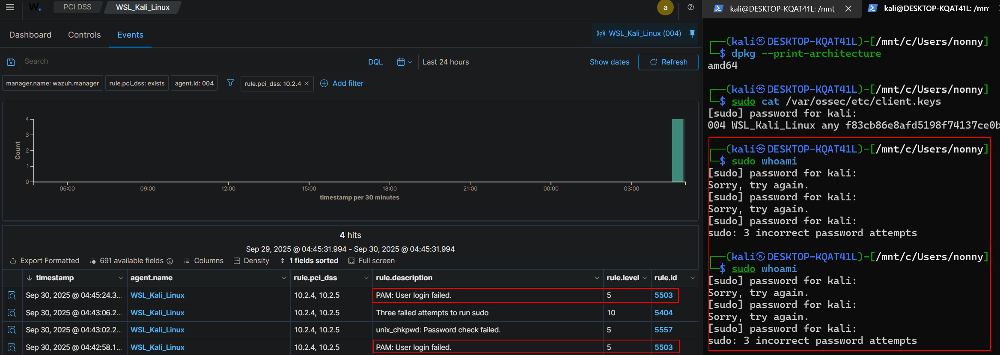
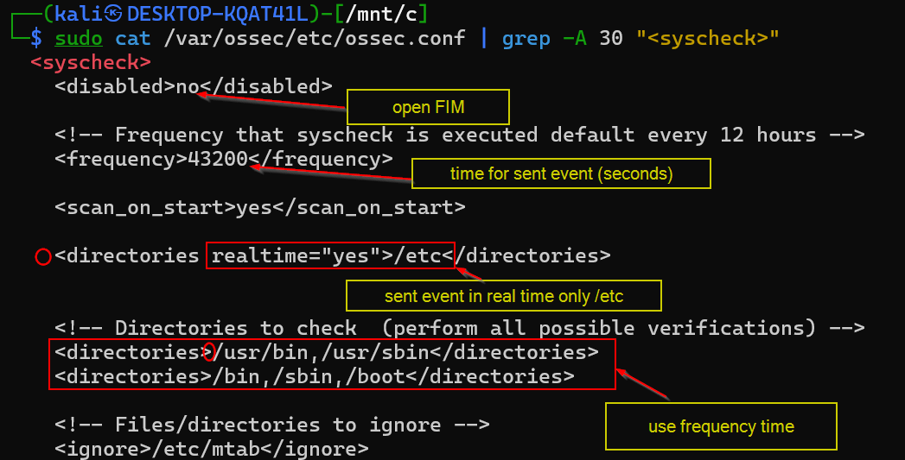
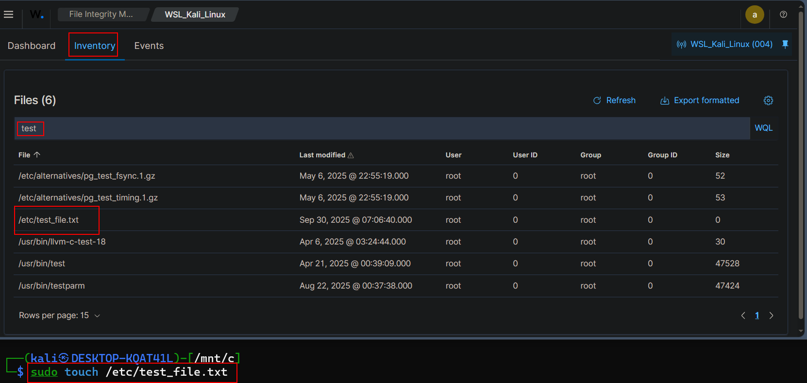
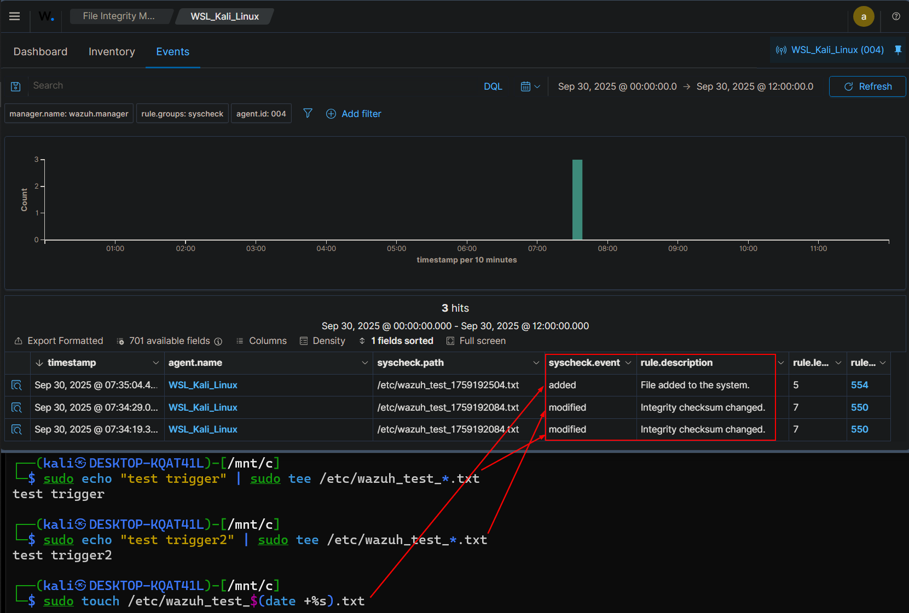

# Wazuh


## Agent modules

- Active Response: agent จะ automate response ,custome response
- Configuration assessment: agent จะคอย scan ระบบอย่างต่อเนื่อง ใช้มาตรฐานจาก CIS benchmarks ,ทำ custom policie ได้
- Log collector: agent อ่าน log จากใน OS ต่างๆ ,Rules and decoders ????
- Command execution: agent รัน command เป็นระยะๆเพื่อสื่อสารกับ Wazuh manager
- File integrity monitoring (FIM):agent ส่ง report เมื่อ files are created, deleted, or modified

- Malware detection: agent ใช้ non-signature-based approach ในการ detect สิ่งผิดปกติ,rootkit 
  
- Container security monitoring:
- Cloud security monitoring:


┌──(kali㉿DESKTOP-KQAT41L)-[/mnt/c/Users/nonny/OneDrive/Desktop/SiemSoar]
└─$ git clone https://github.com/wazuh/wazuh-docker.git -b v4.12.0

https://documentation.wazuh.com/current/deployment-options/docker/wazuh-container.html


┌──(kali㉿DESKTOP-KQAT41L)-[/mnt/c/Users/nonny/OneDrive/Desktop/SiemSoar/wazuh-docker]
└─$ cd single-node/

┌──(kali㉿DESKTOP-KQAT41L)-[/mnt/c/Users/nonny/OneDrive/Desktop/SiemSoar/wazuh-docker/single-node]
└─$ ls
config  docker-compose.yml  generate-indexer-certs.yml  README.md

┌──(kali㉿DESKTOP-KQAT41L)-[/mnt/c/Users/nonny/OneDrive/Desktop/SiemSoar/wazuh-docker/single-node]
└─$ docker-compose -f generate-indexer-certs.yml run --rm generator

┌──(kali㉿DESKTOP-KQAT41L)-[/mnt/c/Users/nonny/OneDrive/Desktop/SiemSoar/wazuh-docker/single-node]
└─$ docker-compose up -d

```
นำ command มาจาก dashboard wazuh 
Invoke-WebRequest -Uri https://packages.wazuh.com/4.x/windows/wazuh-agent-4.12.0-1.msi -OutFile $env:tmp\wazuh-agent; msiexec.exe /i $env:tmp\wazuh-agent /q WAZUH_MANAGER='172.29.112.1'

สำหรับ window และ
wget https://packages.wazuh.com/4.x/apt/pool/main/w/wazuh-agent/wazuh-agent_4.12.0-1_amd64.deb && sudo WAZUH_MANAGER='172.29.112.1' dpkg -i ./wazuh-agent_4.12.0-1_amd64.deb
สำหรับ kali ก็เชื่อมต่อกับ wazuh manger แล้วแสดงบน dashbroard
```

## กลไกการเชื่อมต่ออัตโนมัติ

1. **Agent ติดตั้งและระบุ Manager IP** (`WAZUH_MANAGER='172.29.112.1'`)

2. **Agent ติดต่อ Manager ครั้งแรก:**
   - Agent ส่งข้อมูลตัวเองไปหา Manager
   - ขอ authentication key

3. **Manager ออก key ให้อัตโนมัติ:**
   - Manager สร้าง unique key ให้ agent
   - บันทึก agent ลงใน database
   - ส่ง key กลับไปให้ agent

4. **Agent บันทึก key และเริ่มส่งข้อมูล:**
   - Key ถูกเก็บไว้ที่ `/var/ossec/etc/client.keys` (Linux) หรือ `C:\Program Files (x86)\ossec-agent\client.keys` (Windows)
   - Agent เริ่มส่ง logs และ alerts ไปยัง Manager




# Test Authentication Events

```
runas /user:wronguser cmd
```






# Test File Integrity Monitoring (FIM)

## Config defualt

```
  <syscheck>
    <disabled>no</disabled>

    <!-- Frequency that syscheck is executed default every 12 hours -->
    <frequency>43200</frequency>

    <scan_on_start>yes</scan_on_start>

    <!-- Directories to check  (perform all possible verifications) -->
    <directories>/etc,/usr/bin,/usr/sbin</directories>
    <directories>/bin,/sbin,/boot</directories> 
```


```
after config change
sudo systemctl restart wazuh-agent
```


