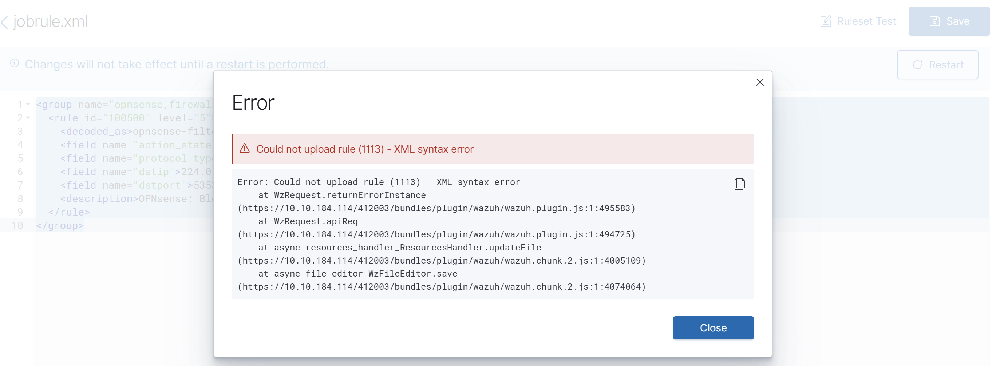
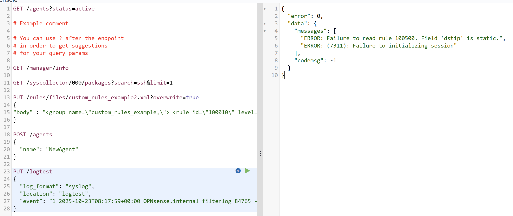
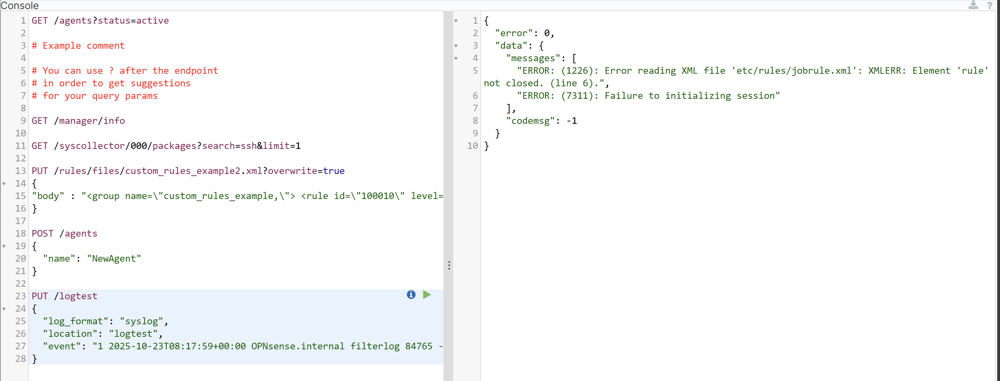
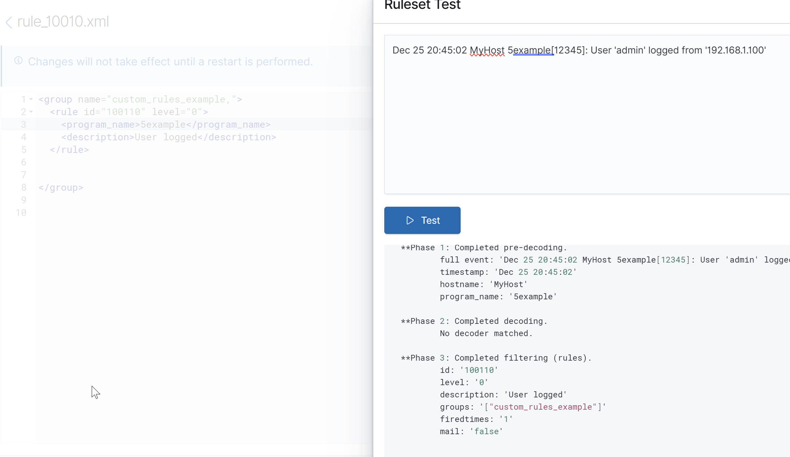
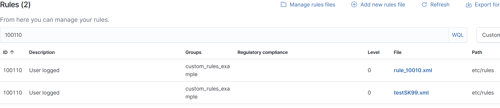
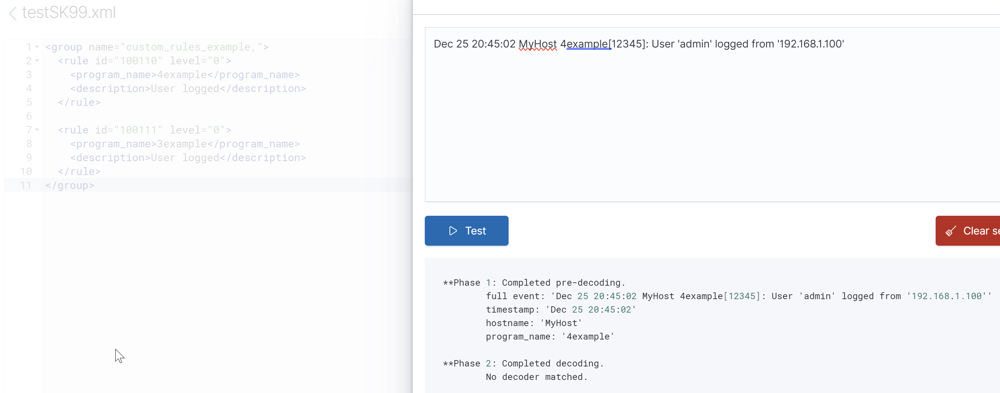
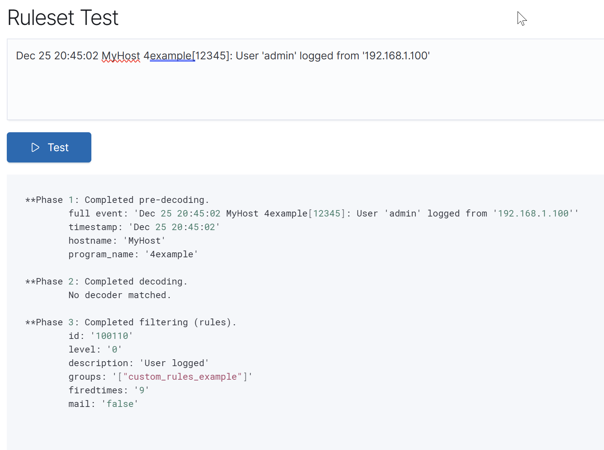

# Wazuh Logtest — ผลลัพธ์ครบทุกกรณี (รวม Error + Multi-Rule)

---

## 🔴 Error Cases

### Error 1 — Invalid/Malformed Session Token
```
error: Invalid token '...' 
```
**สาเหตุ:** ส่ง token session ที่หมดอายุหรือผิดรูปแบบผ่าน API (`/logtest` endpoint)

---

### Error 2 — Empty Log Input
```
error: Event not found
```
**สาเหตุ:** ส่ง string ว่างเข้าไป logtest รับ input ไม่ได้

---

### Error 3 — Logtest Daemon Not Running
```
ERROR: Cannot connect to /var/ossec/queue/sockets/logtest
ERROR: Logtest is not running
```
**สาเหตุ:** `wazuh-analysisd` ไม่ได้ start หรือ socket ไม่มี

```bash
# แก้ด้วย
systemctl restart wazuh-manager
# ตรวจ socket
ls -la /var/ossec/queue/sockets/logtest
```

---

### Error 4 — Rule File Syntax Error (ตอน reload)
```
error: Rules file '/var/ossec/etc/rules/local_rules.xml' is corrupted: 
       XML error: 'Opening and ending tag mismatch' (line 42)
```
**สาเหตุ:** XML malformed → analysisd โหลด rule ไม่ได้ → rule ใหม่จะ **ไม่มีผล**

```bash
# ตรวจ syntax ก่อน reload เสมอ
/var/ossec/bin/wazuh-logtest -t
xmllint --noout /var/ossec/etc/rules/local_rules.xml
```






---

### Error 5 — Duplicate Rule ID
```
error: Duplicated rule ID: 100001 in file local_rules.xml
```
**สาเหตุ:** Rule id ซ้ำกับ rule อื่นที่มีอยู่แล้ว → rule จะถูก **skip ทั้งคู่** หรือ load แค่ตัวแรก







#### warnning จะขึ้นแค่ครั้งแรก




---

### Error 6 — Invalid Regex in Rule
```
error: (1203): Error compiling regex: '(unclosed group'
```
**สาเหตุ:** Regex ใน `<match>` หรือ `<field>` เขียนผิด syntax → rule นั้น **ไม่ถูก load**

---

### Error 7 — Referenced SID ไม่มีอยู่จริง
```
warning: (...)  Parent rule '99999' not found for rule '100050'
```
**สาเหตุ:** ใช้ `<if_sid>99999</if_sid>` แต่ rule id 99999 ไม่มี → child rule จะ **ไม่ทำงาน**

---

## 🟣 Phase 3 — Multi-Rule Matching Cases

### กรณี A — Rule Chaining (Parent → Child)
```
**Phase 3: Completed filtering (rules).
        Rule id: '100021'          ← child rule ที่ fire
        Level: '10'
        Description: 'Root authentication failure'
        
        [Matched via if_sid: 100020]   ← parent ที่ถูก reference
```

flow จริงในหัว engine:
```
Log → match rule 100020 (level 3) → check child rules
    → match rule 100021 (if_sid: 100020) → level 10 → ALERT 100021
```
**สำคัญ:** Wazuh จะ **alert เฉพาะ rule สุดท้าย** ที่ match ใน chain — ไม่ alert parent ด้วย

---

### กรณี B — Frequency Rule (Correlation) ใน Logtest

```
**Phase 3: Completed filtering (rules).
        Rule id: '100022'
        Level: '14'
        Description: 'Root brute force attack'
        
        *Rule 100022 needs 5 events to fire (frequency rule)
         logtest only processes 1 event — counter not evaluated*
```

**พฤติกรรมจริง:** Logtest แสดงว่า rule structure ถูกต้อง แต่ **จะไม่นับ frequency** เพราะ stateless — ต้องการหลาย event จริงๆ

วิธี simulate frequency ใน logtest:
```bash
# ส่ง log เดิมซ้ำใน session เดียวกัน (interactive mode)
/var/ossec/bin/wazuh-logtest
# แล้ว paste log บรรทัดเดิม 5 ครั้งติดกัน → counter จะสะสมใน session
```

---

### กรณี C — Multiple Rules Match Level เท่ากัน (First Match Wins)

```
**Phase 3: Completed filtering (rules).
        Rule id: '5716'            ← rule แรกที่ match
        Level: '8'
        Description: 'sshd: Insecure connection attempt'
```

Wazuh ใช้หลัก **First Match Wins** — engine scan rules ตามลำดับ rule id จากน้อยไปมาก, rule แรกที่ match ชนะ, rule อื่นๆ ที่อาจ match ด้วยจะ **ไม่ถูก evaluate ต่อ** (ยกเว้น child rules)

```
Rule 5710 → match? YES → STOP → Alert 5710
Rule 5715 → (never checked)
Rule 5716 → (never checked)
```

---

### กรณี D — Overwrite Rule (ปิด Default Rule ด้วย Custom)

```xml
<!-- ใน local_rules.xml -->
<rule id="5710" level="0" overwrite="yes">
  <description>Suppress SSH unknown user alert</description>
</rule>
```

```
**Phase 3: Completed filtering (rules).
        Rule id: '5710'
        Level: '0'
        Description: 'Suppress SSH unknown user alert'
```

**ผล:** Default rule 5710 ถูก overwrite → level กลายเป็น 0 → **suppressed ทั้ง environment**

---

### กรณี E — Same Log Match ทั้ง Specific Rule และ Catch-All Rule

```
Log: "Failed password for invalid user admin from 10.0.0.1"
```

```
Engine evaluation:
├─ Rule 5710 (specific: sshd invalid user) → MATCH ✅ → ALERT → STOP
└─ Rule 1002 (catch-all: unknown error)    → never evaluated
```

Rule ที่ specific กว่า (child ของ decoder) จะ **match ก่อนเสมอ** ถ้ามี `if_sid` ชี้ไปที่ parent ที่ถูกต้อง

---

## สรุปรวมทุกกรณี

```
Input
  │
  ├─► [ERROR] Daemon not running / socket missing
  ├─► [ERROR] Empty input → "Event not found"
  │
  ▼
Phase 1: Pre-decoding
  │
  ▼
Phase 2: Decoder
  ├─► No decoder matched                    (กรณี 1)
  └─► Decoded ✅
        │
        ▼
Phase 3: Rule Engine
        │
        ├─► No rule matched                 (กรณี 2)
        │
        ├─► Single rule, level > 0          (กรณี 3) ✅ ALERT
        │
        ├─► Single rule, level = 0          (กรณี 4) 🔕 SUPPRESSED
        │
        ├─► Chain: Parent → Child fire      (กรณี A) ✅ ALERT (child only)
        │
        ├─► Frequency rule (stateless)      (กรณี B) ⚠️ PARTIAL
        │
        ├─► First match wins                (กรณี C) ✅ ALERT (first only)
        │
        ├─► Overwrite rule level=0          (กรณี D) 🔕 SUPPRESSED
        │
        └─► Specific beats catch-all        (กรณี E) ✅ ALERT (specific)

Rule Load Errors (ก่อน logtest ทำงาน):
  ├─► Duplicate rule ID
  ├─► XML syntax error
  ├─► Invalid regex
  └─► Referenced SID not found
```