# 1. Add Rule On dashboard

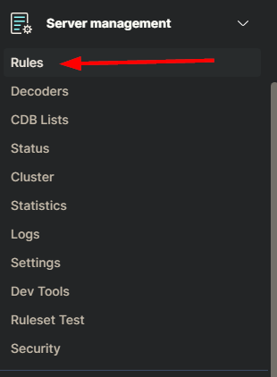

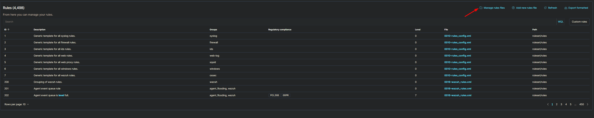

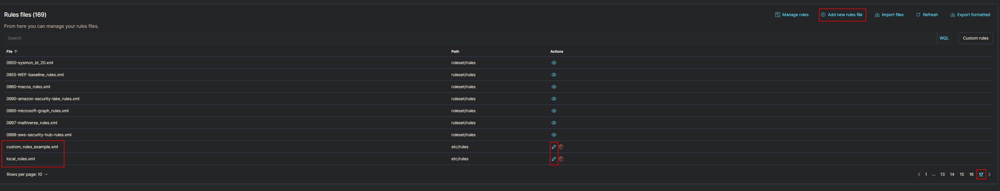

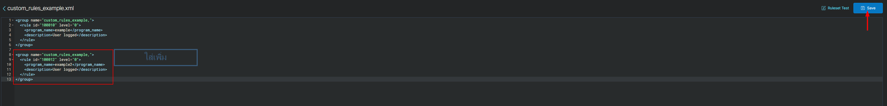

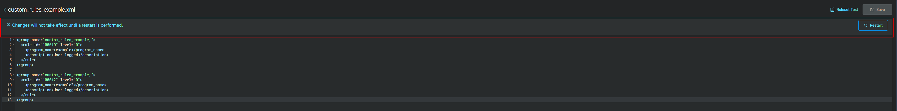

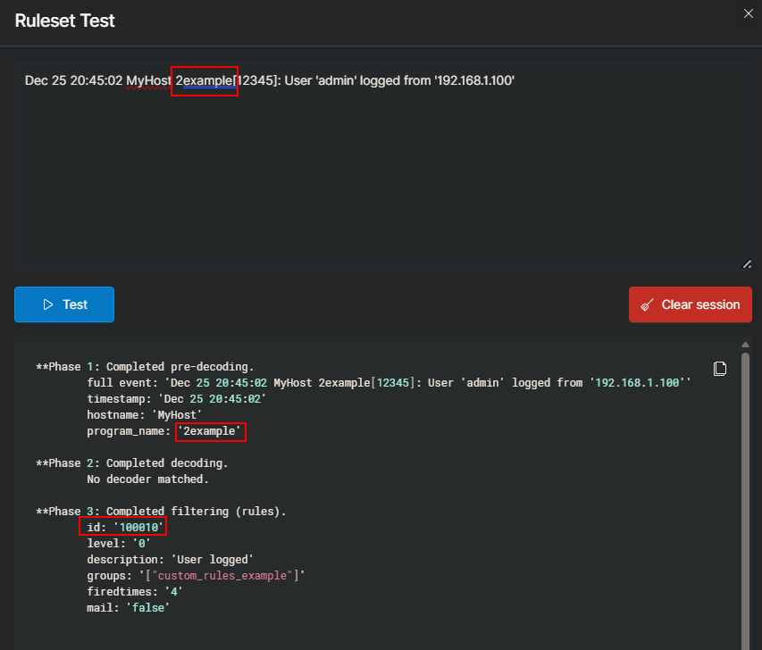

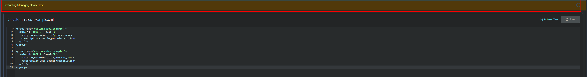


**Log มี `program_name: '2example'`** แต่กลับ **match กับ rule 100010** ที่มี `<program_name>example</program_name>`

นี่แสดงให้เห็นว่า:

### `<program_name>` ใน Wazuh ทำ **Substring/Contains Match**

```
program_name: "2example"
↓
ตรวจสอบว่ามี substring "example" อยู่ไหม? → ✓ YES
↓
Match rule 100010
```

**ไม่ใช่ exact match อย่างที่ผมบอกผิดไป!**

## ทำไม Rule 100012 ไม่ match?

เพราะ **Wazuh ใช้หลัก "First Match Wins"**:

1. ประเมิน rule 100010 → `program_name` มี "example" → **Match แล้ว!**
2. หยุดการประเมิน → ไม่ไป evaluate rule 100012 อีก
3. ถึง rule 100012 จะ match ด้วย "2example" แต่ Wazuh หยุดแล้วที่ rule แรก

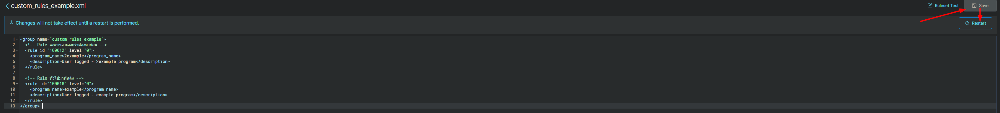

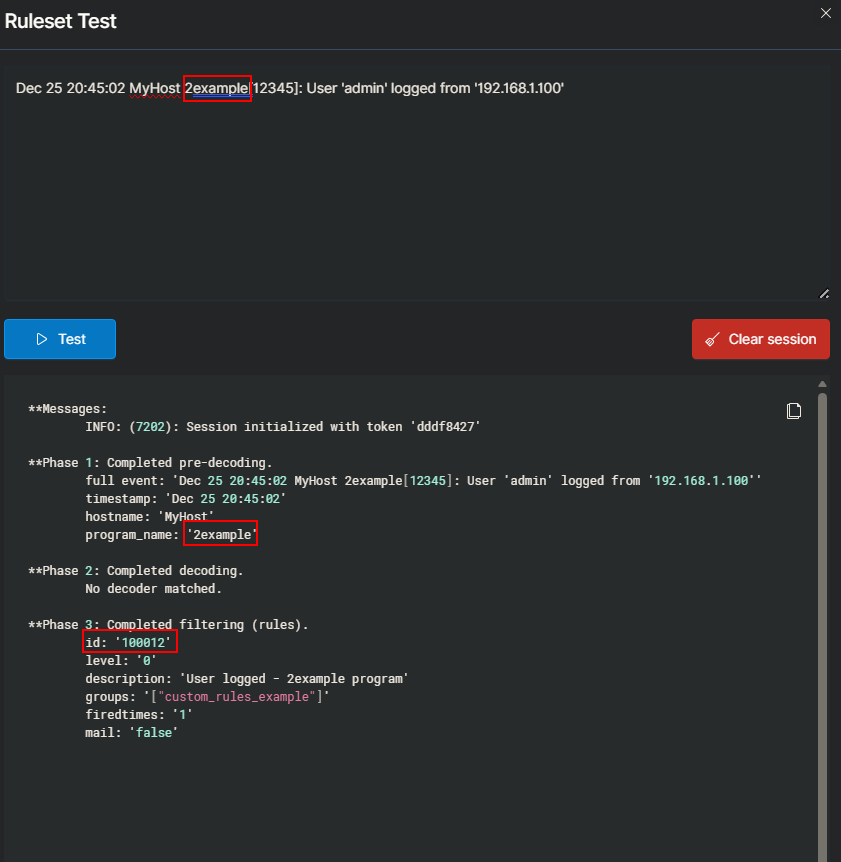

## สรุป

1. ย้าย rule ที่ละเอียดกว่าอยู่ข้างบน
2. ต้องไม่ต้อง restart manager ก่อน ก็สามารถ logtest ได้
3. ต้อง restart manager ก่อน ถึงจะได้ alert จาก rule นั้น


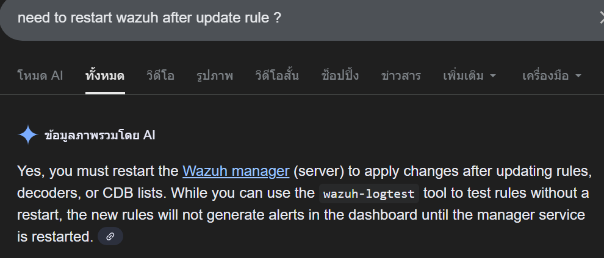


# 2. Add rule by API


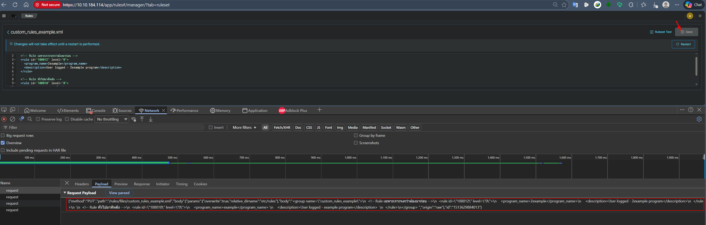

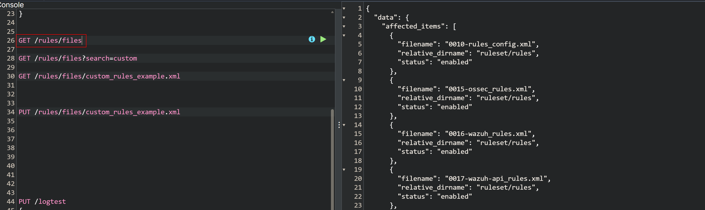

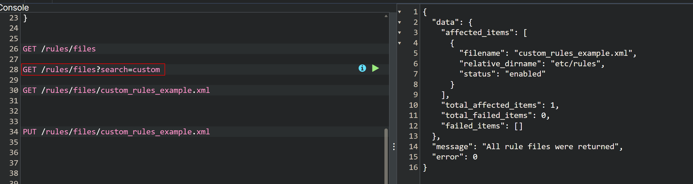

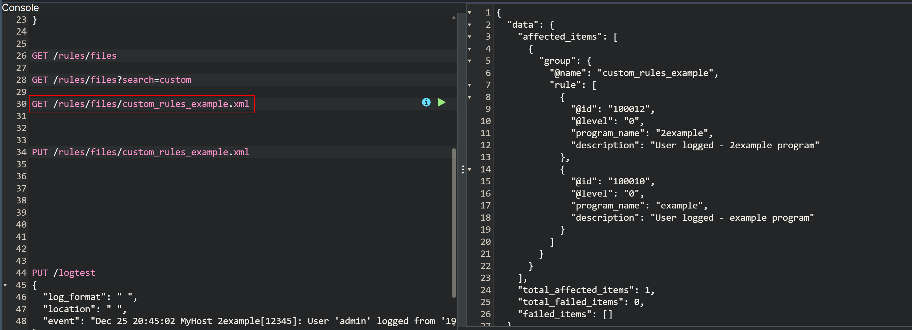

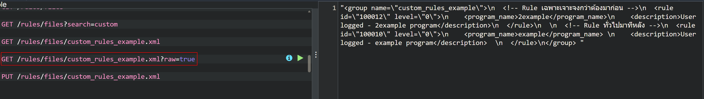

https://www.freeformatter.com/json-escape.html#before-output

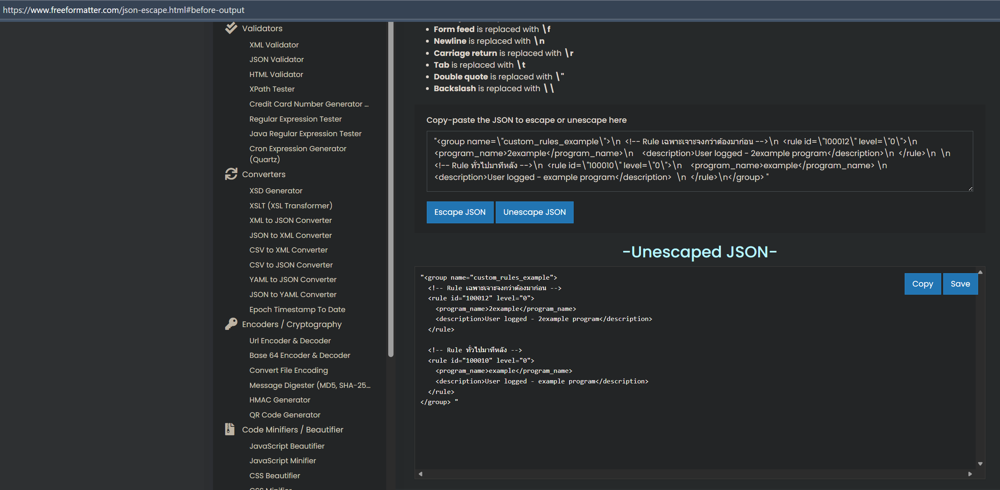


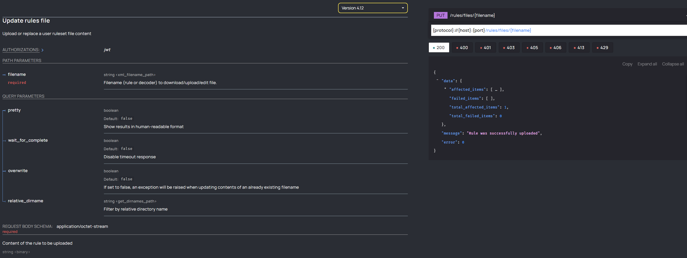

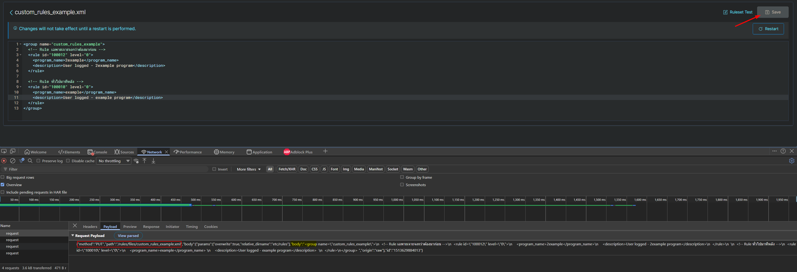

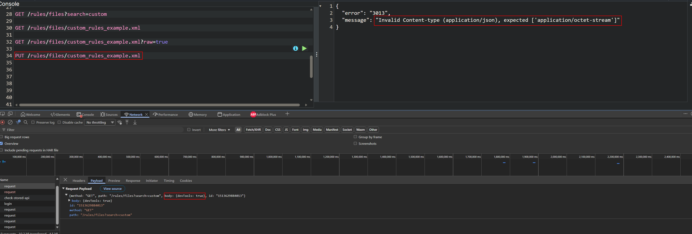

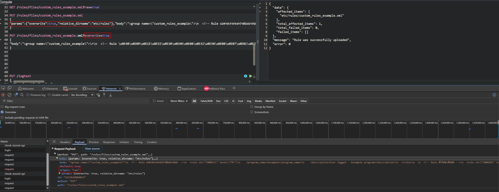

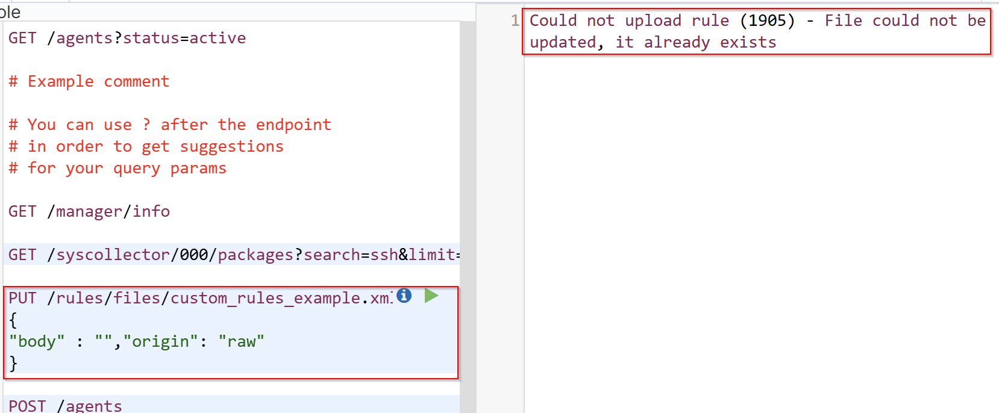

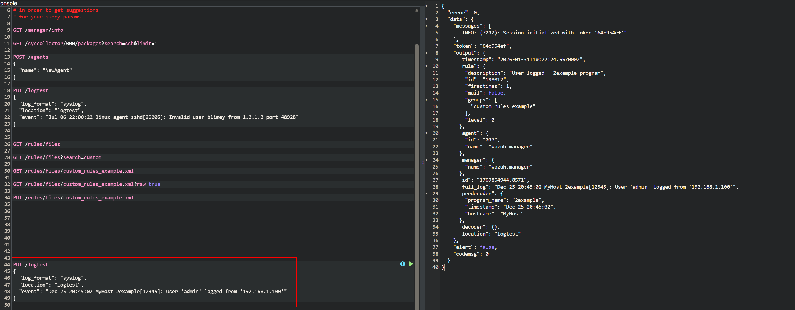

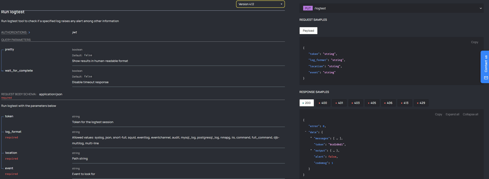

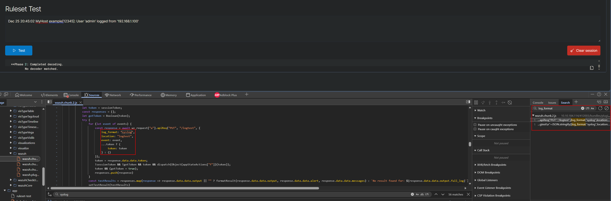


# 3. script python

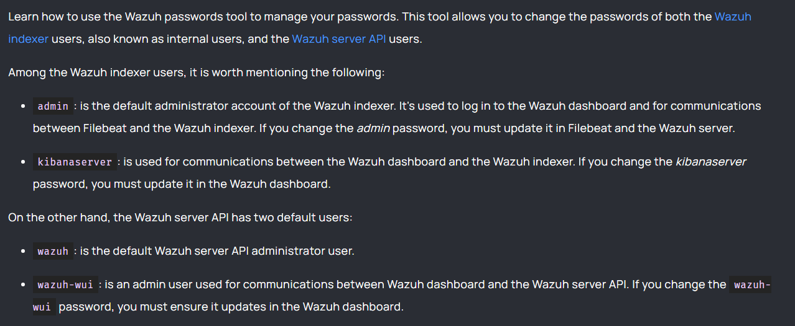

Wazuh Indexer users (internal users) - ผู้ใช้ที่อยู่ใน database ของ Wazuh Indexer

Wazuh Server API users - ผู้ใช้สำหรับเข้าถึง Wazuh Manager API

- ใช้ admin: default administrator account of the Wazuh indexer ในการ call wazuh api ไม่ได้

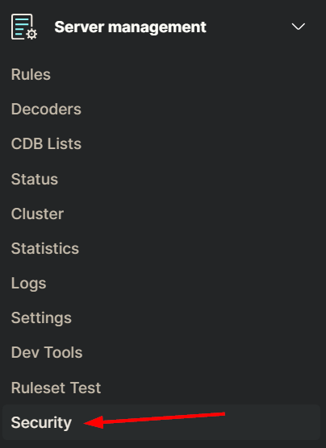

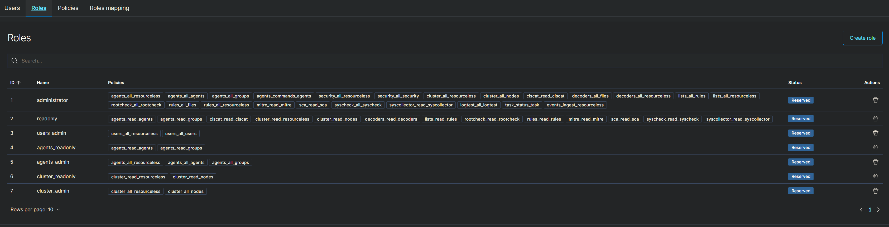

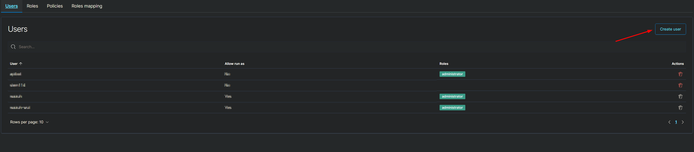

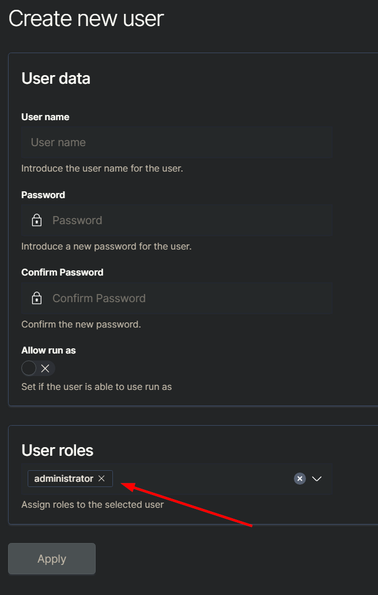

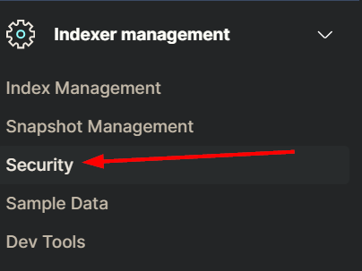

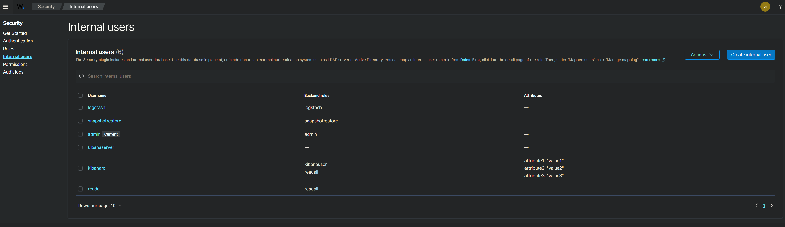


